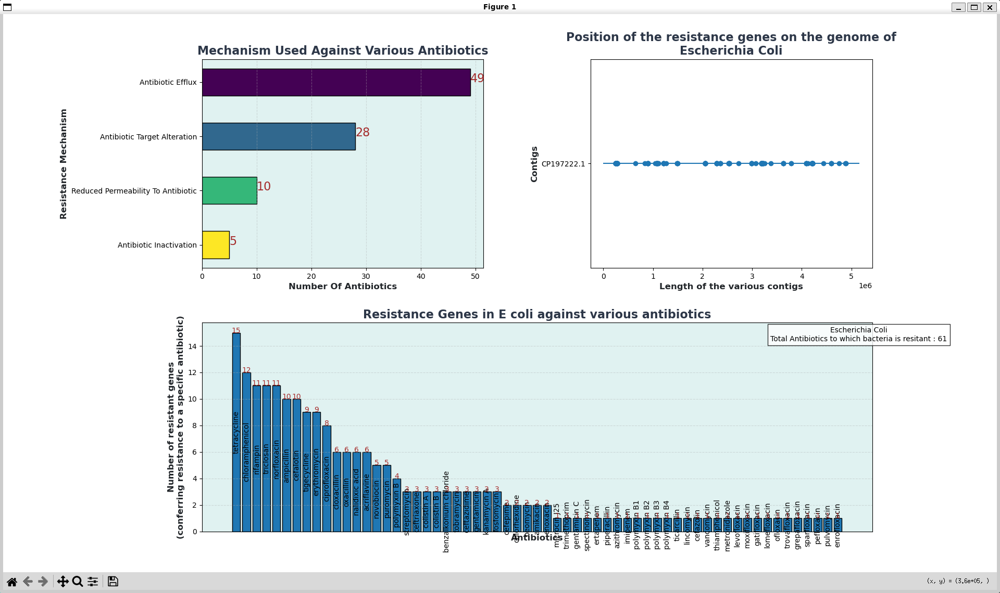

# AMR Scanner — Bacterial Antibiotic Resistance Gene Pipeline

A command-line pipeline that, given the name of a bacterial species, downloads a reference
genome assembly from NCBI, scans it for antibiotic-resistance genes using **RGI**
(Resistance Gene Identifier, from the **CARD** database), cleans the results, and renders a
3-panel dashboard summarizing the resistome — which genes were found, which antibiotics
they affect, which resistance mechanisms are involved, and where on the genome they sit.

This document covers setup (WSL + Miniconda + RGI), how the pipeline works internally, and
how to run it without getting stuck.

---

## Table of Contents

1. [Overview](#1-overview)
2. [Project Structure](#2-project-structure)
3. [How It Works](#3-how-it-works)
4. [Prerequisites](#4-prerequisites)
5. [Setup Guide](#5-setup-guide)
6. [Running the Pipeline](#6-running-the-pipeline)
7. [Output / Data Folder Structure](#7-output--data-folder-structure)
8. [Module & Function Reference](#8-module--function-reference)
9. [Understanding the Final Dashboard](#9-understanding-the-final-dashboard)
10. [Troubleshooting](#10-troubleshooting)
11. [Known Limitations](#11-known-limitations)
12. [Credits & Data Sources](#12-credits--data-sources)

---

## 1. Overview

You give the program a bacterial species name (e.g. `Escherichia coli`). It:

1. Searches NCBI for matching genome assemblies and lets you pick one.
2. Downloads and decompresses the reference genome (FASTA).
3. Runs it through **RGI**, which matches the genome against the **CARD** antibiotic
   resistance ontology/database.
4. Cleans the raw RGI output into a tidy CSV.
5. Builds a 3-panel visualization: resistance mechanisms vs. antibiotics, gene positions
   across contigs, and resistant-gene counts per antibiotic.

Every organism you scan is cached in its own folder under `data/`, so re-running the
program for the same organism skips straight to plotting instead of re-downloading and
re-scanning.

---

## 2. Project Structure

```
amr-scanner/
├── environment.yml       # conda environment definition (see Setup)
├── main.py               # ⭐ entry point — run this file
├── rgi_scanner.py        # orchestrates download → RGI scan → clean
├── datadownloader.py     # NCBI search + genome download
├── data_cleaner.py       # cleans raw RGI output into filtered_data.csv
├── images/
│   └── dashboard.png     # dashboard screenshot used in this README (§9)
└── data/                 # created automatically at runtime (see §7)
```

> Only the five `.py`/`.yml` files above are needed to **run** the pipeline. The `images/`
> folder is just a doc asset for this README — it has no effect on the program itself.

**`main.py` is what you run.** Everything else is a module it imports.

---

## 3. How It Works

```
python main.py
        │
        ▼
rgi_scanner.loader()
        │
        ├─► datadownloader.downloader()
        │        │
        │        ├── data/<Organism>/ already exists? ──Yes──► return (organism, None)
        │        │                                              (use cached results, skip everything below)
        │        │
        │        └── No ──► search NCBI "assembly" DB (top 5 hits)
        │                    ──► you pick one (1–5)
        │                    ──► download genome.fna.gz ──► decompress to genome.fna
        │                    ──► return (organism, file_path)
        │
        ▼ (only runs if file_path is not None, i.e. a fresh download)
   Run RGI CLI on genome.fna:
     rgi main --input_sequence genome.fna --output_file pipeline_results
               --clean --input_type contig
        │
        ▼
   pipeline_results.txt / pipeline_results.json written
        │
        ▼
data_cleaner.cleaner(file_path)
        │  - drops irrelevant RGI columns
        │  - keeps only "Strict"/"Perfect" hits (drops "Loose")
        │  - renames one column
        ▼
   filtered_data.csv saved
        │
        ▼
back in main.py:
   - load filtered_data.csv
   - load every contig in genome.fna into memory
   - slice the actual DNA sequence for each resistance gene hit
   - explode multi-value "Antibiotic" / "Resistance Mechanism" fields
   - aggregate counts
   - render the 3-panel matplotlib dashboard
```

---

## 4. Prerequisites

| Requirement | Why |
|---|---|
| **Windows users:** WSL2 (Ubuntu) | RGI's dependencies (BLAST/DIAMOND via bioconda) are Linux-first; WSL gives you a real Linux environment on Windows. Mac/Linux users can skip WSL and follow the setup directly on their OS. |
| **Miniconda** (inside WSL, or natively on Mac/Linux) | `rgi` is only distributed via conda (bioconda channel) — it is **not** available on PyPI, so `pip install rgi` will not work. Conda is mandatory here, not just convenient. |
| **Internet access** | To query NCBI, download genomes, and download the CARD database. |
| **A personal email address** | NCBI's Entrez API requires a contact email for every request. The program asks for this itself at runtime (see §6) — nothing to configure in advance. |
| **~2–4 GB free disk space** | For the CARD database, downloaded genomes, and conda packages. |

---

## 5. Setup Guide

### 5.1 Install WSL2 (Windows only — skip if you're on macOS/Linux)

Open **PowerShell as Administrator** and run:

```powershell
wsl --install
```

Restart your PC when prompted. This installs WSL2 with Ubuntu by default. Once it's
installed, launch "Ubuntu" from the Start menu and finish the first-run setup (create a
Linux username/password). All the commands below are run **inside this Ubuntu/WSL
terminal**, not in PowerShell.

### 5.2 Install Miniconda

Inside your WSL (or Mac/Linux) terminal:

```bash
wget https://repo.anaconda.com/miniconda/Miniconda3-latest-Linux-x86_64.sh -O ~/miniconda.sh
bash ~/miniconda.sh -b -p $HOME/miniconda3
$HOME/miniconda3/bin/conda init bash
```

Close and reopen your terminal so the `conda` command becomes available. Verify with:

```bash
conda --version
```

### 5.3 Get the project files

Place all the project's `.py` files and `environment.yml` in one folder, e.g.:

```bash
mkdir -p ~/amr-scanner
cd ~/amr-scanner
# copy main.py, rgi_scanner.py, datadownloader.py, data_cleaner.py, environment.yml here
```

### 5.4 Create the conda environment

```bash
cd ~/amr-scanner
conda env create -f environment.yml
conda activate bioinfo
```

`environment.yml` here is a full pinned export (exact package builds, not just top-level
names) taken directly from a working install, so conda doesn't need to solve anything — it
just fetches and links the exact versions listed. It's built for **linux-64** (i.e. WSL
Ubuntu or native Linux); it won't reliably reproduce on macOS or native Windows conda.

It also pulls in a fair number of extra bioinformatics tools (bowtie2, bwa, samtools,
bedtools, kma, jellyfish, prodigal, rpsbproc, entrez-direct, etc.) that this project's
scripts don't call directly — these come along automatically as `rgi`'s own dependencies
for its other subcommands (`rgi bwt`, `rgi kmer_query`, wildcard/variant analysis, and so
on). They're harmless to have installed even though only `rgi main` is used here.

> **For a faster install:** use mamba instead of conda:
> ```bash
> conda install -n base -c conda-forge mamba
> mamba env create -f environment.yml
> ```

Every time you work on this project, activate the environment first:

```bash
conda activate bioinfo
```

### 5.5 Download and load the CARD database (one-time)

RGI needs the CARD reference database loaded into its **system-wide** database location
before `rgi main` will work (the code in this project runs RGI *without* the `--local`
flag, so it always looks for the system-wide load, not a per-folder one). Do this once,
with the `bioinfo` environment activated:

```bash
mkdir -p ~/card_data && cd ~/card_data
wget https://card.mcmaster.ca/latest/data
tar -xvf data ./card.json
rgi load --card_json ~/card_data/card.json
```

Verify it loaded correctly:

```bash
rgi database --version
```

> Re-run `rgi load` whenever CARD publishes a new database version, or after you
> reinstall/upgrade the `rgi` package.

### 5.6 Enable plot windows in WSL

`main.py` ends with `plt.show()`, which pops up a window — this needs a display server:

- **Windows 11 (WSLg):** works out of the box, no extra setup needed.
- **Windows 10:** install an X server on Windows (e.g. **VcXsrv**), launch it, then in your
  WSL terminal:
  ```bash
  echo "export DISPLAY=$(cat /etc/resolv.conf | grep nameserver | awk '{print $2}'):0" >> ~/.bashrc
  echo "export LIBGL_ALWAYS_INDIRECT=1" >> ~/.bashrc
  source ~/.bashrc
  ```
- **macOS/Linux (no WSL):** works natively, nothing extra needed.
- **Don't want to deal with a display server at all?** Open `main.py` and swap the final
  `plt.show()` for `plt.savefig("result.png", dpi=200)` — the dashboard will save to a PNG
  file instead of popping up a window.

---

## 6. Running the Pipeline

With the environment activated and setup (§5) complete:

```bash
conda activate bioinfo
cd ~/amr-scanner
python main.py
```

You'll be prompted:

```
Enter the name of the bacteria : Escherichia coli
```

The name is normalized (spaces → underscores, title-cased) to `Escherichia_Coli`, which
becomes the folder name under `data/`.

**First time scanning this organism** — since no cached folder exists yet, you'll be told
a download is needed and asked for a contact email (required by NCBI on every request):

```
The data for the organism needs to be downloaded!

Please enter your email :  you@example.com
```

Enter a real, valid email address here — it's used only to set `Entrez.email` for the NCBI
request and isn't stored anywhere. You'll be asked this again the next time you scan a
*new* organism; it's skipped entirely for organisms already cached in `data/`.

Next, you'll see a list of candidate assemblies:

```
Please select an organism (with a valid FTP Path) :
1-->
 Name: Escherichia coli str. K-12 substr. MG1655
 Assembly: GCF_000005845.2
 FTP Path : https://ftp.ncbi.nlm.nih.gov/genomes/all/GCF/000/005/845/GCF_000005845.2_ASM584v2
 FTP Path2 : https://ftp.ncbi.nlm.nih.gov/genomes/all/GCA/000/005/845/GCA_000005845.2_ASM584v2
...
Enter your response here : (Select an option out of 1-5) 1
```

Pick a number **1–5** with a valid FTP path (an empty/blank path means that assembly can't
be downloaded — pick a different one). The program then:

1. Downloads and decompresses the genome.
2. Runs RGI (`<<<--------Starting the RGI engine for Escherichia_Coli-------->>>`) — this
   can take a few minutes depending on genome size and CPU (RGI runs a full BLAST/DIAMOND
   search against CARD).
3. Prints `Execution Successful!` and cleans the results.
4. Loads the genome and cleaned data, prints a few debug previews to the console, and pops
   up the 3-panel dashboard.

**Re-running for the same organism** — since `data/Escherichia_Coli/` now exists, the
program skips search/download/scan entirely and jumps straight to loading the cached
`filtered_data.csv` + `genome.fna` and plotting. This is fast.

To scan a different organism, just run `python main.py` again and enter a different name.

---

## 7. Output / Data Folder Structure

Each organism gets its own folder, created automatically:

```
data/
└── Escherichia_Coli/
    ├── genome.fna              # downloaded & decompressed reference genome (FASTA)
    ├── pipeline_results.txt    # raw RGI output (tab-separated) — RGI's native format
    ├── pipeline_results.json   # raw RGI output (JSON) — produced by RGI, not read by this pipeline
    └── filtered_data.csv       # cleaned data actually consumed by main.py for plotting
```

To force a completely fresh re-scan of an organism (new NCBI search, new download, new RGI
run), just delete its folder:

```bash
rm -rf data/Escherichia_Coli
```

---

## 8. Module & Function Reference

### `datadownloader.py` → `downloader()`

- **Parameters:** none (prompts interactively via `input()`).
- **Returns:** `(organism_name, file_path)`
  - If `data/<Organism>/` already exists → returns `(organism_name, None)`. This is the
    cache signal: everything downstream (RGI scan, cleaning) is skipped.
  - Otherwise → creates the folder, searches the NCBI **assembly** database for up to 5
    matches, prompts you to pick one, downloads + decompresses the genome, and returns
    `(organism_name, file_path)`.
- **Side effects:** writes `data/<Organism>/genome.fna`.
- **On failure:** removes the folder it created and exits the program.
- Uses `Entrez.esearch` / `Entrez.esummary` against the `assembly` database. Only for a
  fresh (non-cached) organism, it first prompts you interactively for your email address
  and sets `Entrez.email` from that input — nothing to hardcode or edit in the source.

### `rgi_scanner.py` → `loader()`

- Calls `downloader()`.
- If the result is cached (`file_path is None`) → returns `(organism, None)` immediately
  without touching RGI.
- Otherwise, builds and runs:
  ```bash
  rgi main --input_sequence <file_path>/genome.fna \
           --output_file <file_path>/pipeline_results \
           --clean --input_type contig
  ```
  via `subprocess.run(...)`.
  - On success (`returncode == 0`): prints `Execution Successful!`, calls
    `data_cleaner.cleaner(file_path)`, and returns `(organism, file_path)`.
  - On failure: prints `process.stderr` describing the RGI error.
- Note: the `--local` flag is deliberately commented out in the RGI command, meaning RGI
  reads from the **system-wide** CARD database — the one you loaded in §5.5 with
  `rgi load --card_json ...` (no `--local` flag there either).

### `data_cleaner.py` → `cleaner(file_path)`

- Reads `<file_path>/pipeline_results.txt` (tab-separated).
- Drops these columns: `AST_Source`, `Orientation`, `SNPs_in_Best_Hit_ARO`, `Other_SNPs`,
  `Predicted_DNA`, `Predicted_Protein`, `CARD_Protein_Sequence`, `Hit_Start`, `Hit_End`,
  `Nudged`, `Note`, `ID`, `Model_ID`.
- Keeps only rows where `Cut_Off` is `"Strict"` or `"Perfect"` (drops `"Loose"` hits — the
  lowest-confidence RGI matches).
- Renames `"Percentage Length of Reference Sequence"` → `"% Length of Reference Sequence"`.
- Saves the result to `<file_path>/filtered_data.csv`.
- Wrapped in try/except that **prints** errors rather than raising them — if cleaning
  fails, you won't get a crash, but you also won't get `filtered_data.csv`. Watch the
  console output for `"An error occured while cleaning the file"`.

### `main.py` (entry point)

Orchestrates everything above, then builds the dashboard:

- Loads `filtered_data.csv` and every contig sequence from `genome.fna` into a dict keyed
  by contig ID.
- Adds a `DNA Sequence` column: the actual nucleotide sequence sliced from the genome per
  hit, using each row's `Contig`, `Start`, and `Stop`.
- Splits the `Antibiotic` column on `;` and explodes it (one row per gene–antibiotic pair,
  since a single gene can confer resistance to several antibiotics).
- Computes `Antibiotics`: value counts of `Antibiotic`, renamed to **"Number of resistant
  genes"**.
- Splits and explodes `Resistance Mechanism` the same way.
- Computes `total_ab`: total number of distinct antibiotics the organism shows resistance
  genes against.
- Computes `grouped_data`: per resistance mechanism, the unique list and count of
  antibiotics it's linked to (**"Number of antibiotics"**), sorted descending.
- Renders the 3-panel matplotlib dashboard (see §9) and calls `plt.show()`.

---

## 9. Understanding the Final Dashboard



*Example dashboard output — resistance mechanisms vs. antibiotic counts (top-left), gene
positions across contigs (top-right), and resistant-gene counts per antibiotic (bottom).*

The figure has three panels (via `GridSpec(2, 2)`):

- **Top-left — "Mechanism Used Against Various Antibiotics"**
  Horizontal bar chart. One bar per resistance mechanism; bar length = number of distinct
  antibiotics that mechanism is linked to across all detected genes.

- **Top-right — "Position of the resistance genes on the genome"**
  One horizontal line per contig, drawn to scale of that contig's length. Scatter points
  mark the midpoint position of each detected resistance gene along its contig — a quick
  map of where resistance genes physically sit in the assembly.

- **Bottom — "Resistance Genes in [organism] against various antibiotics"**
  Bar chart, one bar per antibiotic; bar height = number of resistance genes found that
  confer resistance to it. An annotation box in the corner shows the organism name and the
  total count of distinct antibiotics it shows resistance to.

---

## 10. Troubleshooting

| Symptom | Likely Cause | Fix |
|---|---|---|
| `rgi: command not found` | `rgi` not installed, or the conda env isn't active | `conda activate bioinfo`; check with `rgi -h` |
| RGI errors about missing/unloaded database | CARD database never loaded (system-wide) | Run the `rgi load --card_json ...` step in §5.5 |
| Plot window never appears (WSL) | No display server attached | Set up WSLg (Win11) or an X server (Win10) — see §5.6 — or switch `plt.show()` to `plt.savefig(...)` |
| `Error while downloading the data!` / NCBI request errors | Rate-limited, blocked, no internet, or an invalid/blank email entered at the prompt | Enter a real email address when prompted; check connectivity; retry after a short wait |
| Same organism re-downloads every time instead of using the cache | You typed the name slightly differently each run (extra spaces, different casing, etc.), producing a different folder name | Use the same spelling each time — it's normalized to `Title_Case_With_Underscores`, so `"e coli"` and `"E. Coli"` will *not* map to the same folder |
| `FileNotFoundError` on `filtered_data.csv` even though the organism's folder exists | A previous run's RGI scan or cleaning step failed partway through, leaving an incomplete folder | Delete `data/<Organism>` and re-run from scratch |
| `rgi main` takes a very long time | Normal for larger genomes — RGI runs a full BLAST/DIAMOND search against CARD | Be patient; a typical bacterial genome (~5 Mb) usually finishes within a few minutes |
| Column-related errors (`KeyError`, etc.) while plotting | `pipeline_results.txt` wasn't produced as expected (RGI version mismatch, failed run) | Confirm you saw `Execution Successful!`; inspect `pipeline_results.txt` directly to check its columns |

---

## 11. Known Limitations

- **No `--local` RGI flag:** the pipeline depends on the *system-wide* CARD database load,
  not a per-project local one. If you're used to `rgi main --local`, note this project
  intentionally doesn't use it.
- **Partial-failure handling:** if `rgi main` fails, `rgi_scanner.loader()` doesn't return a
  usable `file_path`, and `main.py` doesn't explicitly guard against that case — a failed
  scan can surface as a confusing downstream error rather than a clean message. If
  something goes wrong mid-pipeline, it's usually safest to delete the organism's `data/`
  folder and start over.
- **Cache correctness depends on exact folder presence, not completeness:** if a folder
  exists but is missing `filtered_data.csv` (e.g. an interrupted run), the program will
  still treat it as "cached" and try to load a file that isn't there.
- **Single-user, single-run design:** no protection against two runs writing to the same
  `data/<Organism>/` folder simultaneously.

---

## 12. Credits & Data Sources

- **[CARD / RGI](https://card.mcmaster.ca/)** — Comprehensive Antibiotic Resistance
  Database and the Resistance Gene Identifier tool, McMaster University.
- **[NCBI Entrez / Assembly database](https://www.ncbi.nlm.nih.gov/assembly/)** — reference
  genome search and download.
- **[Biopython](https://biopython.org/)** — Entrez/SeqIO handling.